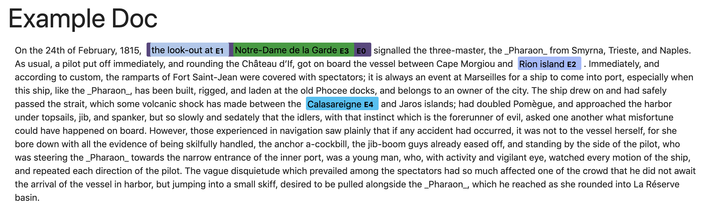

# highlight_mentions

Install:

```
pip install git+git://github.com/nmonath/kdcovid.gi
```

Use:
```
from highlight_mentions.highlighter import Highlighter, Mention, Doc

# Create document / mention objects
doc = Doc('Example Doc', doc_text, [m1, m2, m3, m4, m5])
highlighter = Highlighter()
# Create HTML formatted output
with open('example.html', 'w') as fout:
    fout.write(highlighter.html_page(doc))
```



Notes:
* Highlighting style inspireed by disPlaCy.
* Using materialize css/js.
